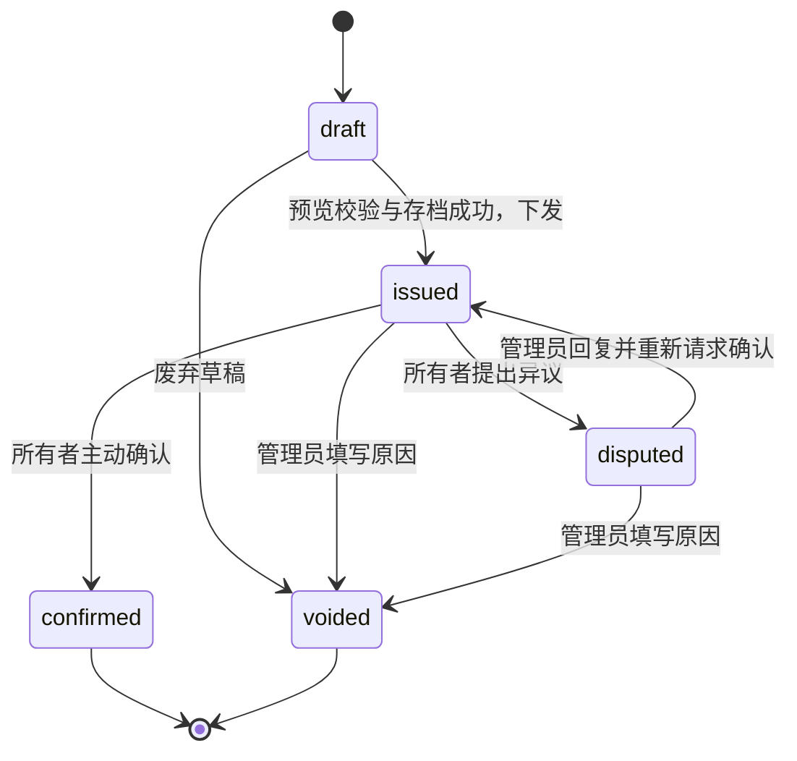

# 账单查询与月度对账单：产品设计方案

设计基线：v0.3，2026-09-09，源码调研基线 `7c4d7aa`。本文保留批准开发前的完整方案；用户随后批准收敛到管理员与下游客户消费对账的一期开发，实际实现与未纳入本期的扩展能力以 [实施与验收说明](BILLING_STATEMENTS_IMPLEMENTATION.zh_CN.md) 为准。

配套文档：[技术方案](BILLING_STATEMENTS_TECH.zh_CN.md)、[数据汇总与凭证固化专项设计](BILLING_STATEMENTS_DATA_PIPELINE.zh_CN.md)。第 11 节记录已反馈的业务决策；新增技术细节为评审方案，不代表已经实现。

## 1. 产品定位与范围

新增“账单与对账”功能，覆盖两种不同用途：日账单用于查询账户在一天内各小时的消费；月度对账单用于管理员核对、下发，用户确认，并保存当时的内容与确认凭据。

按用户确认，平台资金全部来源于管理员为用户充值额度，不使用赠送和订阅。产品只呈现一个账户消费口径：已经入账的消费和补扣减消费退款，称为“本期净消费金额”；移除上一版的订阅分区及多来源汇总。

管理员充值增加可用额度，不增加消费金额，也不作为消费退款。充值、扣减和覆盖余额需要独立的结构化资金记录供核查，但正式消费单据的正文仍以消费明细为主。本轮不把管理员配置的额度充值等同于已核验的银行收款，也不擅自扩展为包含期初/期末余额的资金流水产品。

确认操作仅表示账户用户确认该版本的消费信息，不产生再次扣款、付款或退款。系统提供业务确认记录与 PDF，不将它标为银行回单、税务发票或经过认证的电子签章。

## 2. 核心业务口径

### 2.1 金额的含义

采用以下单一消费口径：

| 指标 | 定义 | 展示位置 |
| --- | --- | --- |
| 消费金额 | 已入账的服务消费与补扣，包含已实际扣收的附加费用 | 日账单、月对账单 |
| 消费退款金额 | 消费退款或费用冲减；原扣款可能发生在上月 | 日账单、月对账单 |
| 本期净消费金额 | 消费金额减消费退款金额 | 主要对账金额 |
| 调用数 | 产生账单记录的逻辑调用去重计数 | 补扣、退款不重复增加；不等同于日志条数 |

其他规则：

- 采用系统实际结算的 quota，不根据当前模型价格重新计算历史消费。
- 未完成的预扣只属于待结算信息，不算最终消费。同一次结算只计最终总额，不能把预扣和最终总额再相加。
- 对已受理且已按现行规则入账的异步任务，先展示已入账金额；后续补扣或退款作为独立变动展示。
- 实际发生的工具附加费、失败请求附加费等必须纳入并说明类型；已包含在最终金额中的费用不再重复累加。
- 零费用调用显示为零，并保留有意义的调用信息。没有数据和数据缺失不能都显示为零。
- 当本期退款大于消费时，净消费可以为负，表示本期净退回；这不会使系统产生新的负扣费。

### 2.2 时间与跨月处理

建议全系统使用一个对账时区，初始为 `Asia/Shanghai`，在页面与 PDF 中明确展示。用户“今天”、小时分桶、月份边界及确认截止时间都按这个时区解释。

日账单采用自然日，月份采用自然月，后端统一使用起点包含、终点不包含的区间。例如 8 月账期是 `[8 月 1 日 00:00, 9 月 1 日 00:00)`。跨日调用按实际入账时间归属，并保留调用发生时间供追溯。

建议采用“入账时间”口径：8 月 31 日已入账消费 10 元，9 月 2 日退款 3 元，8 月账单保留消费 10 元，9 月记录退款 3 元，并关联原调用。不会悄悄改掉已下发的 8 月对账单。尚未完成的预扣在实际结算入账时进入相应账期。

当前月可以预览，完整自然月对账单在月末结束、数据校验通过后才允许下发。建议默认预留 24 小时结账缓冲，可配置为 0；这是处理数据和检查异常的等待期，不是自动派发时间。已确认入账、仍等待上游最终任务结果的项目可带后续调整说明；资金结果不明或已发现漏账的项目会阻止正式下发。

对账时区在启用正式记账后固定。以后如需变更，应在明确的账期边界迁移，并保留旧账单时区。

### 2.3 货币、汇率与精度

现有系统区分消费展示汇率与购买额度的充值价格。一期消费对账使用消费展示汇率，不使用充值价格推算用户实际付款。

| 系统展示模式 | 日账单建议 | 正式对账单建议 |
| --- | --- | --- |
| USD | 美元金额 | 固定 USD，汇率为 1 |
| CNY | 按系统汇率显示人民币 | 固定下发版本采用的人民币汇率 |
| CUSTOM | 按自定义汇率和符号显示 | 同时保存明确的币种/单位名称与符号；信息不全时禁止下发 |
| TOKENS | 按系统设置显示额度，另列 USD 金额参考 | 标题使用 USD 消费金额，同时列 quota 额度，采用已接受的 D4 建议 |

日账单按当前配置查询，并说明当前展示口径；管理员预览时显示本次采用的汇率。正式下发后冻结币种、汇率、单位换算、精度和总额。以后管理员修改系统汇率，已下发和已确认的账单仍保持原金额。

API 调用存在很小的费用，建议明细和对账总额统一保留 6 位小数，禁用 k/M 缩写。底层保留完整整数额度和精确十进制金额。逐行展示舍入导致的差额，由系统在汇总区单独列为“展示舍入差额”，保证“展示明细 + 舍入差额 = 展示总额”，且不改变实际扣费额度。若业务要求 2 位金额，需连同舍入规则一起确定，不能仅修改页面格式。

## 3. 用户端

### 3.1 入口与页面

“个人”区域增加“账单与对账”，含“日账单”和“我的对账单”。待用户处理的账单数量作为入口角标；详情使用独立页面，便于链接、浏览器返回和移动端阅读。

```text
账单与对账
  日账单       我的对账单（待处理数量）

日期 [2026-09-09] [前一天] [后一天] [今天]    对账时区：Asia/Shanghai
本期净消费金额     消费金额     退款金额     调用数
数据截至：14:32:10                            [刷新]

小时              消费金额     退款金额     净消费       调用数
00:00–01:00       …           …           …            …
01:00–02:00       …           …           …            …
…
23:00–次日00:00   —           —           —            —
合计及展示舍入差额
```

这里是信息布局示意，不是已经实现的界面。页面同时显示该用户的正式记账开始时间与统计截至时间。

### 3.2 日账单交互

- 日期选择到“天”，默认对账时区下的当天，禁止选择未来日期。
- `Asia/Shanghai` 下展示 24 个小时区间；已过去且无消费的小时补零，当前小时标为“统计中”，未来小时显示“尚未到达”，不当成已结算的零消费。
- 主要信息为金额汇总和小时明细。小时趋势图作为辅助，可表达退款导致的负值，并提供对应数据表。
- 点击小时可下钻至该小时的账单记录：入账时间、业务编号、模型、费用类型、消费/退款额度和金额，再链接永久保留的使用日志查看调用信息。
- 页面前台可每 30 秒刷新当天数据，提供手动刷新和最后入账/汇总时间。历史日无需持续轮询。
- 查询失败保留筛选条件并展示重试；不展示误导性的零金额。汇总落后时明确提示数据截至时间。
- 正式记账起点之前显示“未纳入正式记账”，不填为零；首日从配置的准确时刻开始。起点之后如有数据缺失，明确提示异常并阻止对应正式出单。

### 3.3 我的对账单列表

支持按月份、状态筛选，并提供待处理快捷入口。字段包含：对账单号、账期、企业抬头、币种、本期净消费、状态、下发时间、确认截止时间、确认时间、详情和 PDF 下载。

用户只能看到向自己正式下发过的版本；管理员草稿不可见。已作废版本继续保留并标明原因和替代版本。列表默认突出待确认和异议待处理项，不能因为只显示本月而隐藏上月未确认账单。

### 3.4 正规对账单详情与 PDF

采用便于打印、核对的单据结构：

| 区域 | 内容 |
| --- | --- |
| 页首 | 平台品牌、出具主体、文档标题、对账单号、版本 |
| 账户与账期 | 用户 ID、用户名、企业抬头和税号快照、起止日期、正式记账起点、时区、出具时间 |
| 金额摘要 | 消费、补扣、退款、本期净消费；明确单位和汇率 |
| 按日明细 | 正式覆盖内每个自然日一行：日期、调用数、消费、退款、净消费；无消费日补零；起点前的日期标注不纳入 |
| 调整说明 | 跨期退款/补扣的汇总与原业务引用；不能用不透明的手填数字改总额 |
| 核对说明 | 入账口径、实际覆盖范围、未结算事项、舍入规则与差额 |
| 确认区 | 当前状态、确认主体、确认时间、确认内容版本；未确认时显示待确认 |
| 页尾 | 单据编号、页码、版本校验信息、受登录保护的系统核验入口 |

网页可从每日行进入“该单据版本”的小时和逐笔明细，读取已固化的明细集；不能重新按当前用户资料、日志或汇率拼装。跳转至当前日账单时明确提示这是实时查询，防止混淆历史快照与当前汇率。

PDF 采用 A4 纵向、金额右对齐、重复表头、明确分页；按日汇总为正文，较长的调整记录分页或在网页分页查看。正常 28–31 天的对账单建议控制在约 2–4 页，最终取决于字段与文字长度。支持文字搜索和复制，不以整页截图作为存档文件。

### 3.5 用户确认

用户读到完整账单后点击“确认对账”，弹窗再次展示单号、版本、账期、币种和净消费额。确认声明必须主动勾选，不默认选中。

建议声明语义：“我已核对本对账单所列账期、费用明细与合计，确认本版本内容。”同时说明确认不会再次扣费。最终文本及语言版本均随确认记录保存。

确认成功后显示服务器记录的时间，并可下载“对账单及确认记录”。重复点击或网络重试返回同一确认结果；管理员不能替目标用户确认。拥有管理员角色的用户可以作为所有者确认自己的账单。

确认采用真实登录会话，保存确认者、会话关联标识、版本、内容摘要和服务器时间。IP/设备等辅助信息按隐私配置最小化记录，仅管理员审计可见。不会把用户浏览器时间作为正式确认时间。

### 3.6 异议

在待确认状态提供“提出异议”，要求填写原因，可引用日期或业务编号；一期采用文本，暂不加入附件或完整客服工单系统。

管理员回复后有两条路径：账单无误则带解释重新请求确认；单据汇总、抬头或展示有误则作废原单，并从纠正后的汇总/资料生成新版本下发。若发现的是实际多扣费用，真实退款记入退款发生的账期，原期仍保留实际发生的扣款，双方通过关联记录核对。用户重新核对再确认，管理员的“已处理”不能替代用户的确认。

### 3.7 企业抬头与税号维护

用户在个人资料增加“对账主体”区域，维护企业名称（抬头）和税号。两项为企业正式出单必填；可选联系邮箱，税号使用字符串保存，保留前导零，不把它当成数字。

一期每个用户维护一个当前主体，修改时生成资料版本及审计记录。用户只能维护自己；管理员可查看，确有需要时可通过明确授权的管理动作代维护并记录操作者。普通用户列表、登录响应和缓存不默认返回完整税号。

预览从当前资料版本取值，下发前检查版本是否变化。正式下发后，将企业名称和税号的当时值保存在单据正文；用户以后改名称/税号，不影响已出具单据。资料缺失时可以查询消费，但不能正式下发企业对账单；管理员获得“请先补全对账主体”的具体提示。

## 4. 管理员端

### 4.1 账户账单查询

“管理”区域增加“账单管理”。日账单默认查询管理员自己，增加可搜索账户选择器，展示用户 ID、用户名与显示名，查询以不可变的用户 ID 为准。

切换账户后复用用户端日期、小时表和下钻逻辑。页面持续显示当前查询账户；快速切换时取消旧查询，防止 A 用户数据被显示在 B 用户标题下。账户选择器分页搜索，不一次加载全体用户。

### 4.2 月度预览和创建

流程建议为：选择账户与月份 → 检查数据覆盖和异常 → 预览 → 保存草稿 → 核对并下发。

预览默认上一个已结束月份，也允许查看当前月趋势。必须选择一个账户，不能把“全部账户”直接生成为一张用户单据。

预览检查项包括正式记账起点、数据覆盖、未决资金异常、消费/退款归集、主体资料版本、舍入差额、现有有效单据、账期内尚可能后续调整的任务。阻断项给出原因与处理入口。

管理员可修改平台出具主体资料和说明；用户企业抬头/税号从其已维护的资料版本读取，需要纠正时先更新资料再重新预览。金额从记账来源生成，不提供任意手改合计。账期财务内容、汇率或主体信息变化会使已有预览过期；其他月份出现新调用不应导致已结束月份的预览失效。

下发是一次业务提交：单据正文、日/小时汇总、逐笔明细集及校验清单、原始 PDF 全部固化校验成功，用户可查询到待确认记录，才算下发成功。准备大量明细时显示后台进度，不阻塞 API 调用。邮件/外部通知的送达结果单独显示，不把“已下发”“已通知”“已查看”“已确认”混为同一状态。

### 4.3 对账进度管理

支持账户、账期、状态、是否逾期、下发时间范围筛选。账户默认本人，可切换到“全部用户”查看处理进度。

列表除用户端字段外，还展示出具人、下发人、最近操作时间、首次查看时间、异议摘要、通知情况，以及查看、回复、提醒、作废/重发等合法动作。

逾期是根据确认截止时间计算的标记，不是自动确认，也不自动停用账户或影响 API 使用。建议默认确认期限 7 天；站内待办始终可用，外部通知复用现有通知偏好，手动提醒限频，自动提醒策略后续配置。

停用或删除账户仍可由有权限的管理员查历史资料；不能通过此功能让管理员冒充用户完成确认。

### 4.4 正式记账开始时间

管理员在创建/编辑用户时配置 `accounting_start_at`，界面名称为“正式记账开始时间”，按上海时区输入日期与时刻。普通用户只读，不能通过个人资料接口修改。

该字段未配置表示未开启该用户的正式对账；配置后首笔纳入条件为 `入账时间 >= 配置时间`。系统保存用户输入的准确起点，不自动改成某月 1 日、最近一条日志时间或部署时间。未来时间按时生效，提前采集的账务记录不丢弃。

过去时间也可选择，但必须验证该日起完整账务数据可用；不满足时显示缺口并拒绝该配置生效，不能悄悄替换为更晚的时间。已正式出具首单后起点只读，普通编辑不能改变历史对账范围；特殊更正需要另外的有审计流程。

例如配置为 9 月 15 日 10:30，则 9 月首单明确覆盖 `9 月 15 日 10:30–10 月 1 日 00:00`；10:00–11:00 小时行只统计 10:30 起的记录。此前的请求是起点外数据，不是缺失数据。

## 5. 状态与版本规则

| 状态 | 用户可见 | 合法操作 |
| --- | --- | --- |
| 草稿 `draft` | 否 | 管理员重新生成、编辑非金额资料、下发、废弃 |
| 待确认 `issued` | 是 | 用户确认/提出异议；管理员提醒或说明原因后作废 |
| 有异议 `disputed` | 是 | 管理员回复后重新请求确认，或作废后生成替代版本 |
| 已确认 `confirmed` | 是 | 查看和下载；确认凭据永久绑定这个内容版本 |
| 已作废 `voided` | 曾下发过的版本可见 | 查看作废原因、历史 PDF 与替代版本；不能确认 |



同一个账户、账期只能有一个有效版本。一期已确认版本不允许直接作废或覆盖；后续实际费用更正通过新的调整记录计入当前账期，并引用原单。若业务必须支持重开已确认账期，需要单独设计双方重新确认的更正单流程，不能隐藏旧确认记录。

对账状态、通知状态、PDF 生成状态分别存储和展示。已确认后附带确认记录的 PDF 生成失败，只重试生成文件，不能回滚用户已成功的确认。

## 6. 日志保留、历史数据和完整性

当前代码确有消费记录开关、历史使用日志删除和可选 ClickHouse TTL。它们是现有实现事实，不符合此次明确的保留要求。修订后的产品约束是：使用日志持续记录、永久保留，使用记录及消费/退款依据不可通过管理页面、API、后台任务或 TTL 清理。

技术实现需同时封住旧清理入口、在途/遗留清理任务、实际删除函数、消费记录关闭配置和日志表 TTL；仅移除按钮不足以满足要求。程序运行诊断文件的轮转属于不同用途，应与使用日志在界面和配置上明确区分；本方案不授权删除使用记录。

正式出单起点以每用户 `accounting_start_at` 为准；底层“已连续采集到数据的最早时间”独立记录用于校验，两者不能混成一个字段。若历史曾关闭记录或已删除，新增字段不能恢复这些数据，必须有完整来源补录后才能将正式起点设置到该期间。

没有消费但覆盖完整，可以出具零金额对账单。覆盖不全、汇总未完成、资金结果不明则阻止正式下发，并说明具体原因。

使用日志、记账事实、单据明细集、PDF、确认、异议和历史版本均纳入长期保留、备份和容量监控，不配置自动删除。归档表示保存为可校验、可读取的固定文件，不等同于删除。未来热冷分层须保持历史查询及完整数据，单独评审迁移方案。

一期旧 MySQL 记录继续完整保留；固化明细可以放私有云存储，减少反复查询源库，但不会自动回收源库空间。较旧的云端文件可评估低频存储，不能因日期久远而直接删除，或让原本即时下载的旧单据突然需要等待解冻。长期容量触发历史层迁移时，完整性、历史检索及恢复流程先通过验证；保留数据不等于将所有数据库恢复日志永久保存，两类策略分别管理。

## 7. 视觉、可访问性与多语言

采用现有 Base UI / shadcn 项目组件：日期选择、账户搜索、Tabs、汇总卡片、数据表、状态徽标和确认弹窗。界面沿用项目主题、间距与图标体系；正式单据使用适合白底打印的版式。

移动端保留当前账户和日期信息，以可读的金额摘要和明细卡片/可横向滚动表格呈现；确认操作区不遮挡末行。状态同时使用文字和颜色，异常、缺失数据和退款不只依赖颜色区分。

所有操作可通过键盘完成，确认弹窗管理焦点，金额及表格列具有明确单位。前端页面覆盖现有 7 种语言：en、zh、zh-TW、fr、ja、ru、vi。PDF 语言在创建版本时确定并冻结，下载时不静默切换语言；模板需覆盖相应字符和日期表达。

## 8. 一期与后续范围

| 一期完整交付 | 后续扩展 |
| --- | --- |
| 用户与管理员按日/小时查询和下钻 | 充值、余额勾稽的完整资金流水页面 |
| 持久账单记录、使用日志永久保留、每用户正式记账起点 | 经验证的历史数据补录 |
| 单用户月度/首期预览、草稿、下发 | 多账户批量下发、周期自动派发 |
| 确认、时间戳、异议回复、作废和替代版本 | 已确认账单的双向更正单、多级复核 |
| 站内待办、复用通知通道、手动限频提醒 | 丰富提醒策略、企业级对账联系人 |
| 正式 PDF、逐笔固化明细集和确认记录存档 | 面向用户的 CSV/XLSX 导出、标准电子签章 |
| 用户企业抬头与税号维护、出单资料快照 | 每账户多企业主体、独立授权的对账联系人 |
| 权限、审计、幂等、三种主数据库支持 | 独立财务角色和按组织/项目合并出账 |

不将批量派发或自动派发作为一期默认行为，避免未经管理员逐单核对就向用户下发内容。

## 9. 核心验收场景

| 场景 | 预期结果 |
| --- | --- |
| 用户打开日账单 | 默认对账时区今天，已完成小时补零，当前/未来小时有明确状态 |
| 管理员切换账户 | 只显示目标账户信息，不残留上一个账户金额 |
| 普通用户替换 URL 中用户 ID 或单据编号 | 无法读取他人账单、PDF、异议或确认记录 |
| 同一请求预扣 10、最终消费 7 | 消费记录是 7，不是 17，也不是退款导致的负消费 |
| 已入账异步任务 10、补扣 2、退回 4 | 对账净额 8，调用数不重复增加 |
| 上月消费、本月退款 | 上月已下发版本不变，本月出现有来源引用的退款 |
| 管理员充值 100、用户消费 8 | 消费总额为 8，充值作为独立资金变动可核查，不混入消费 |
| 修改系统货币设置 | 新查询使用当前设置，旧正式单据及 PDF 金额不变 |
| 用户确认时管理员并发作废 | 只允许一个合法状态转换成功，另一个刷新状态后处理 |
| 用户多次点击确认 | 同一确认时间、同一凭据，不产生重复动作 |
| 预览后金额/设置已变化 | 下发提示预览过期，要求重新核对 |
| 邮件失败或用户未读 | 对账状态保持待确认，不误记为已查看/已确认 |
| 确认后 PDF 生成失败 | 确认有效，文件可重试生成，原始 PDF 可继续下载 |
| 尝试关闭使用记录或清理使用日志 | 页面、API、后台任务与 TTL 路径均不能生效 |
| 起点设置在月中某时刻 | 首期严格按该时刻纳入，起点前标注不纳入，首小时正确截取 |
| 用户试图修改正式起点 | 拒绝；管理员修改已出具单据的起点也被普通编辑路径拒绝 |
| 用户修改企业抬头或税号 | 未下发预览失效，已下发正文/PDF/确认主体保持原快照 |
| 月单包含大量逐笔记录 | 后台分块固化，重复预览和下载不扫描原始请求表 |
| 历史数据缺失或入账异常 | 明确显示覆盖/异常，禁止伪装成完整月对账单 |
| 只有退款或零金额月份 | 正确显示负净额或零，不触发额外扣款 |

## 10. 参考依据

银行单据通常包含账户、账期、摘要和逐笔活动，便于与另一份记录核对；本方案借鉴这种信息层次，并将消费对账与余额流水的范围明确分开。[Chase：银行对账单结构与用途](https://www.chase.com/personal/banking/education/basics/what-is-a-bank-statement)。

对已出具单据的更正采用有来源关联的新版本，并保留原单作废记录，这种模式可参考 Stripe 的修订单与作废机制；本文的“用户确认”是本产品自定义流程，不采用其支付状态含义。[Stripe：修订已出具单据](https://docs.stripe.com/invoicing/invoice-edits?testing-method=with-code)、[Stripe：保留作废单据记录](https://docs.stripe.com/api/invoices/void)。

## 11. 用户反馈后的决策记录

| 编号 | 决策 | 已反馈的方向 | 本版落实 |
| --- | --- | --- | --- |
| D1 | 对账范围与主要金额 | 所有资金来自管理员额度充值，不使用赠送、订阅 | 单一净消费金额；管理员额度变动单独记账核查，不混入消费 |
| D2 | 时间口径 | 接受原建议 | 上海时区、入账时间、自然月、跨期调整计当前期、24 小时缓冲 |
| D3 | 对账流程 | 接受原建议 | 手动单用户下发、7 天期限、异议、未确认作废重发、不自动确认 |
| D4 | 金额与正式单据 | 接受原建议 | 系统货币、下发时冻结汇率、6 位小数、TOKENS/CUSTOM 对应规则 |
| D5 | 正式记账时间 | 管理员在用户资料配置，首次记账时间为配置值 | 增加准确到时刻的每用户起点，完整性校验和首期边界处理 |
| D6 | 出具与确认主体 | 用户维护企业抬头和税号，下发时绑定主体 | 当前资料版本 + 出具快照；后续修改不影响历史 |
| D7 | 一期数据底座 | 接受补齐可靠记账的建议，要求深入考虑性能和明细固化 | 主库事务、增量汇总、独立冻结明细集、完整性校验与存档 |

容量补充：当前生产记录最多约千条，预计日常最大为万级请求，用户要求预留两个数量级；本版按日常 1 万、验证目标 100 万请求/日设计，生产主库为 MySQL，可使用新中间件。该目标不代表已经完成压测或数据库规格已确定。

追加反馈：用户认可其余设计，继续询问一主一从承载、数据库调优及旧归档/历史处理。专项设计第 10.4–10.7 节已补充对应结论；推荐当前规模基础治理优先、一主一从作为承载架构，百万/日需压测和长期容量计划。未获得生产配置前，不声称现有实例已验证达标。

本轮更新设计并回答技术疑问；尚未开始实现或执行生产数据库变更。
