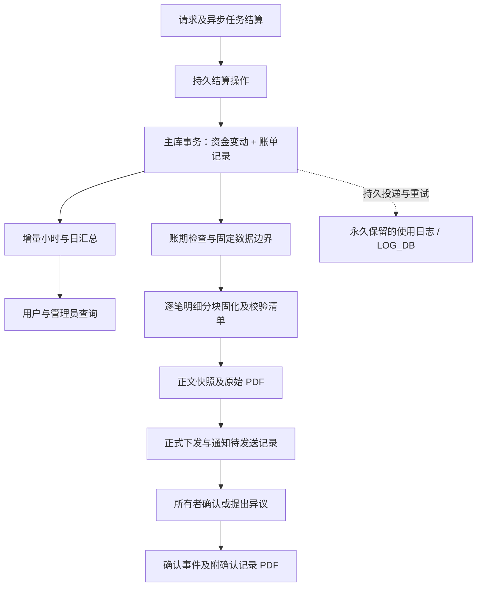

# 账单查询与月度对账单：技术设计方案

设计基线：v0.3，2026-09-09，源码调研基线 `7c4d7aa`。本文保留批准开发前的完整方案；用户随后批准收敛到管理员与下游客户消费对账的一期开发，实际实现与未纳入本期的扩展能力以 [实施与验收说明](BILLING_STATEMENTS_IMPLEMENTATION.zh_CN.md) 为准。

产品定义及已反馈决策见 [产品方案](BILLING_STATEMENTS_PRD.zh_CN.md)。日志保留、增量计算、逐笔明细固化及故障恢复详见 [数据汇总与凭证固化专项设计](BILLING_STATEMENTS_DATA_PIPELINE.zh_CN.md)。下文为推荐实现方案，性能数字是待验证目标，不是已有实测结果。

## 1. 现有实现与复用边界

| 当前代码 | 已有能力或事实 | 本功能的处理方式 |
| --- | --- | --- |
| [model/log.go](../../model/log.go) 的 `RecordConsumeLog` | 消费日志保存额度、账户、模型等；`LogConsumeEnabled` 可关闭；创建失败只记录错误 | 改为持续记录、持久重试、永久保留；仍不作为唯一账单来源 |
| [model/log.go](../../model/log.go) 的 `SumUsedQuota` | 实际只汇总消费类型，未净减退款；`DeleteOldLogBatch` 可删除历史 | 不直接复用为正式账单总额查询 |
| [model/usedata.go](../../model/usedata.go) | 小时统计先存进程内存再周期落库，受数据导出开关影响，未区分钱包和订阅 | 可供旧数据参考，不能用作正式对账事实 |
| [model/main.go](../../model/main.go) | 主数据库与 `LOG_DB` 可以分离；日志数据库支持 ClickHouse | 新账务表位于主库，不要求跨库事务/跨库联表 |
| [service/billing_session.go](../../service/billing_session.go) | 统一预扣、结算和退款；现有幂等主要依赖进程内状态；差额为零时提前返回 | 接入持久结算操作；差额为零也必须登记最终消费 |
| [service/funding_source.go](../../service/funding_source.go)、[model/quota_reserve.go](../../model/quota_reserve.go) | 源码支持钱包/订阅；钱包可先操作 Redis 再持久化 | 本平台仅管理员充值的钱包资金；资金事实采用主库事务 |
| [model/user.go](../../model/user.go)、[model/utils.go](../../model/utils.go) | 额度变动可通过内存批量更新；主库与缓存并非一个事务 | 可靠记账路径不能继续依赖内存资金队列 |
| [service/task_billing.go](../../service/task_billing.go) | 任务提交消费、后续补扣、退款分别发生；退款日志保存正额度，类型表示方向 | 记录独立入账事件，关联原业务和资金来源，不重复计请求数 |
| [service/midjourney.go](../../service/midjourney.go)、[service/violation_fee.go](../../service/violation_fee.go) | 遗留绘图计费和失败请求附加费存在独立路径 | 纳入接入清单，不能只处理文本请求 |
| [common/quota_math.go](../../common/quota_math.go) | 单次计费饱和保护、钱包额度边界已有统一规则 | 保留原保护；月度汇总另做精确且有界的累加 |
| [web/src/lib/currency.ts](../../web/src/lib/currency.ts)、[general_setting.go](../../setting/operation_setting/general_setting.go) | USD/CNY/CUSTOM/TOKENS；消费展示汇率与充值价格不同 | 新查询遵循配置；正式单据使用冻结配置格式化 |
| [middleware/auth.go](../../middleware/auth.go)、[service/authz](../../service/authz) | UserAuth/AdminAuth、细粒度权限注册、真实登录会话识别 | 复用认证，新增账单权限，确认要求所有者真实会话 |
| [service/system_task.go](../../service/system_task.go)、[model/system_task.go](../../model/system_task.go) | 后台任务持久状态与租约；当前同一任务类型只允许一个 active key | 用于单个扫描型处理器，不把每份 PDF 直接排成同类型 SystemTask |
| [service/storage/driver.go](../../service/storage/driver.go) | 对象存储抽象存在，目前仅阿里云 OSS 驱动可用 | 小文件可存主库；大规模明细归档推荐私有 OSS，不能假设已经配置 |
| [controller/user.go](../../controller/user.go) 的额度管理 | 管理员可以增加、扣减、覆盖额度，现有审计以操作日志为主 | 三种动作纳入同库结构化资金记录，消费与充值分开 |
| [router/api-router.go](../../router/api-router.go)、[service/system_task.go](../../service/system_task.go) | root 可创建历史日志清理任务，实际删除不按消费类型豁免 | 移除清理能力，并拦截遗留任务；不能只隐藏前端按钮 |

上述结论来自代码检查，不代表已检查生产库、生产日志保留情况或真实数据量。本轮没有修改计费逻辑、安装 PDF 依赖或执行业务迁移。

## 2. 推荐架构

正式对账需要在主库保存“已实际入账的账单记录”和“结算未完成的持久操作”。使用日志永久保存调用证据；小时/日汇总服务查询；正式单据保存正文、独立明细集和凭证。永久保留不代表已有日志具备资金事务一致性，两项都要补齐。

推荐选择“可靠记账 + 查询汇总 + 单据快照”，而不是只对已有 `logs` 或 `quota_data` 增加 GROUP BY。后者可以实现参考查询，但无法保证日志关闭、进程崩溃、退款和多节点下的数据完整性。

容量基线为日常万级请求，验证目标为百万请求/日，主库 MySQL。首选 MySQL 持久队列与后台 worker，复用 Redis 做缓存/唤醒提示；不强制引入 Kafka、Flink 或新的分析数据库。分块归档可使用私有 OSS；所有中间件选型都是设计建议，本轮没有部署变更。

建议一主一从作为数据库承载架构，主库处理资金事务与强一致读写，从库热备并按条件承担历史只读任务。现有代码只有主库/可写日志库连接，没有读副本路由；第一阶段无需为了小型账单查询先做读写分离，尤其不能将 `LOG_SQL_DSN` 指向只读从库。主从不自动扩大主库写吞吐，也不替代独立备份及故障转移机制。

这会涉及现有资金提交边界，属于方案中的主要工程成本。保留模型定价和 billingexpr 的现行语义，扩展的是持久化、去重和对账读取；不能借此重新计算或改变用户既有费率。

## 3. 数据模型

以下为逻辑字段和约束，最终 GORM 结构以实现时三库迁移验证为准。JSON 类型信息用 TEXT 存储，经 `common.Marshal/Unmarshal` 读写；账户与账单主键采用 GORM 生成，公开 ID 使用服务端生成的不可预测标识。

### 3.1 记账与汇总

| 表 | 主要字段 | 关键约束 |
| --- | --- | --- |
| `billing_accounts` | `user_id`、`accounting_start_at`、`policy_version`、`capture_start_at`、`coverage_status`、时区/单位版本、`last_entry_seq`、关闭边界、当前主体版本 | `user_id` 唯一；业务起点与技术采集起点分开；每账户递增序号；出具首单后普通编辑不得修改起点 |
| `billing_coverage_intervals` | 用户/全局采集代次、区间起止、完整/缺口、来源批次、验证结果与时间 | 保存连续覆盖证据和中断区间；不能仅凭最早时间证明此后全部完整 |
| `billing_profile_versions` | 用户、资料版本、企业抬头、税号、联系邮箱、操作者、生效时间 | `(user_id, version)` 唯一，版本只追加；当前指针单独保存；完整税号不进入公共用户 DTO |
| `billing_operations` | 内部业务标识、用户、请求/任务标识、资金来源、预留额、最终金额、阶段、结算修订号、结果摘要、错误、重试信息 | `(user_id, operation_key, revision)` 唯一；记录执行中、已提交、已释放、待核查等阶段 |
| `billing_wallet_movements` | 用户、操作/修订、资金动作、金额、动作前后余额、预留变动、管理员及原因、时间 | 与资金变动同事务；动作幂等唯一；预扣/释放及管理员充值、扣减、覆盖余额可核对，但不重复成为消费 |
| `billing_entries` | 账户序号、用户、操作 ID、业务 ID、入账时间、原发生时间、类型、方向、`amount_quota`、资金来源、单位版本、是否首次调用、关联原记录、用户可见摘要、内部审计信息 | 只追加；`(user_id, account_seq)` 唯一；`(operation_id, entry_kind)` 唯一；金额绝对值非负 |
| `billing_hourly_totals` | 用户、小时起止 UTC 秒、当地日期、消费/退款额度、调用数、费用类型小计、单位版本、投影代号 | `(user_id, generation, hour_start_at, unit_version)` 唯一；不按模型/API Key 扩张维度 |
| `billing_daily_totals` | 用户、当地日期/日边界、消费/退款额度、调用数、单位版本、投影代号 | `(user_id, generation, day_start_at, unit_version)` 唯一；与小时表同一批次更新 |
| `billing_projection_states` | 用户、已应用账户序号、状态、最后成功时间、重建代号 | 每账户一个当前汇总进度；与汇总更新同事务 |
| `billing_projection_queue` | 用户、目标序号、租约、重试时间、错误 | 每用户一个合并待办；记账同事务推进目标，Redis 丢失不丢工作 |
| `billing_boundary_totals` | 用户、正式起点、策略版本、首小时截取汇总、已应用序号 | 首小时不向下取整纳入起点前消费；后台有界计算，查询不反复扫描明细 |
| `billing_usage_log_outbox` | 稳定事件 ID、调用记录载荷、目标日志库、投递状态/租约/重试 | 最小使用记录先持久；跨库投递失败可恢复，不能仅写错误日志后丢弃 |

事件方向采用 `debit` / `credit`，费用类别至少覆盖 `usage`、`task_initial`、`task_adjustment`、`usage_refund`、`special_fee` 和 `zero_usage`。内部额度统一保存非负绝对值，净额在查询时计算。

预扣和释放保存在 operation 及资金变动记录中，不直接当作消费 entries。已被现有业务明确入账的任务初始费用生成 `task_initial`；其后只登记差额。当前 `funding_source` 固定为明确的钱包来源，不依赖从日志 `other` 猜测；发现本平台未启用的来源时进入异常核查，不能静默计入钱包。

一个逻辑调用只在首次账单记录中增加调用数，补扣和退款为零；免费调用使用零费用记录。工具费如果已经折入该次最终 quota，只保存可解释的明细，不再建立会重复累加的消费事件。

请求/任务追溯需保存稳定标识，以及最小的模型/来源描述快照，避免账户、API Key、模型名称被修改或删除后无法解释旧账。不保存 API 密钥、请求正文、提示词或供应商内部敏感数据到用户账单。

索引至少包括 `(user_id, posted_at, account_seq)`、`(user_id, account_seq)`、`operation_id`、原业务引用。`posted_at` 与 `account_seq` 建立后不回写。跨月更正写入当前开放账期，并保存原账期/记录引用。明细字段、索引用途、保留方式及工作队列上界见专项设计。

### 3.2 账期、单据与凭据

| 表 | 主要字段 | 关键约束 |
| --- | --- | --- |
| `billing_periods` | 用户、`billing_month`、自然月起止、实际覆盖起止、时区/单位版本、完整/首期部分范围、关闭状态、固定截止序号、当前有效单据 ID、下一修订号、异常数 | `(user_id, billing_month)` 唯一；首期部分月与该月完整范围不能各创建一张有效单据；作为并发创建/下发的锁定对象 |
| `billing_statements` | 公开 ID、单号、用户、账期 ID、修订号、状态、行版本、前后版本引用、当前/已下发内容版本指针、`content_sha256`、创建/下发/首次查看/截止/确认/作废时间 | 单号唯一；`(period_id, revision)` 唯一；已下发内容指针不改；账户改名不改历史抬头 |
| `billing_statement_contents` | 单据 ID、内容版本、正文快照 TEXT、manifest 引用/哈希、正文哈希、来源资料/配置版本、生成时间 | `(statement_id, content_version)` 唯一；每次候选生成追加，选择正式版本后不可变 |
| `billing_statement_events` | 单据 ID、事件序号、动作、前后状态、操作者、服务器时间、关联会话摘要、声明版本、内容哈希、说明、最小审计信息、幂等标识 | 只追加；确认只允许生成一次；同一动作重试返回原事件 |
| `billing_statement_artifacts` | 单据 ID、内容版本、文件种类、语言、模板版本、字体版本、文件哈希、大小、二进制正文/存储引用、生成状态、租约与错误 | `(statement_id, content_version, artifact_kind, locale)` 唯一；草稿再生成推进内容版本，已完成文件不覆盖 |
| `billing_detail_sets` | 用户、覆盖区间、截止序号、数据格式版本、笔数/金额、清单哈希、封存状态、工作租约 | 独立、不可变的原始额度明细集；按日封存，正式首期边界必要时派生截取集 |
| `billing_detail_chunks` | 明细集 ID、块序号、首末序号、笔数、额度合计、压缩大小、内容/文件哈希、私有存储引用 | `(detail_set_id, chunk_index)` 唯一；逐块有界，完成后不可覆盖 |
| `billing_statement_manifests` | 单据 ID/内容版本、顺序排列的明细集/块引用、范围、笔数/额度合计、货币快照、格式/算法版本、清单哈希 | 每内容版本一个不可变清单；不使用实时日期查询表达动态成员集合 |
| `billing_notification_outbox` | 单据、版本、事件 ID、接收人、通知类别、渠道、尝试次数、下次执行时间、发送状态与错误 | `(event_id, recipient_id, notification_kind, channel)` 唯一；支持重试与限频 |

正文快照含账户、企业抬头/税号和出具主体、正式记账起点、账期、原始额度总计、币种汇率、精度/舍入规则、汇总版本、按日行、按小时行、覆盖说明、调整汇总与固定数据边界，并绑定明细清单哈希。上海时区整月最多 31 日、744 小时，适合有版本的 TEXT；不把千万条调用明细塞进单行或主 PDF。

实时日账单下钻读 `billing_entries`；已下发单据下钻只读其 manifest 指定的固化明细块，金额按该版本冻结的十进制换算规则呈现。逐笔额度、业务描述和成员集合已经保存到独立文件，不依赖现有日志、当前定价或仅有数据库外键。日/小时展示金额直接取正文快照；该方案不要求把全部逐笔数据打印为 PDF。

用 `billing_periods.current_statement_id` 和行锁控制一个账期的有效版本，避免依赖 MySQL 5.7 不支持的条件唯一索引。历史单据和确认事件不做级联删除。

## 4. 资金提交与记账一致性

### 4.1 提交协议

1. 网关生成内部逻辑业务 ID；它不能由客户端的 `X-Request-ID` 直接决定。客户端 Request ID 仅作为可检索关联字段。
2. 在发送上游前创建持久 operation。预扣资金与记录实际预留额在主库同一事务完成；免费/信任额度旁路也要有可追踪的 operation。
3. 收到可确定的结算结果后持久记录目标金额及修订号，进入待提交阶段；数据库不可用时保留可观察的未决状态，不把只写进程日志当成记账成功。
4. 按统一锁顺序锁定账户、operation 与资金记录，确认目标尚未应用；按照已经发生的预扣只调整资金差额，同时写资金变动、最终消费 entry、使用记录 outbox，推进账户序号与汇总待办目标，标记资金结果已提交；全部在一个主库事务内完成。
5. 异步任务终态补扣/退款，在同一事务内更新任务的计费修订/额度标记和 entry。重试同一修订只返回已有结果。
6. 提交后更新或失效缓存，后台投递现有使用日志、更新统计和通知。缓存或日志库失败不撤销已提交的财务事实，持久待办保留并重试；不能丢掉尚未写入日志库的使用记录。

必须保留的两个细节：预扣 10、最终 10 虽然差额为零，仍应登记一次最终消费 10；预扣 10、最终 7 应登记消费 7，预扣释放 3 不应再作为独立业务退款影响消费净额。

资金提交与 API Key 额度调整是不同结果。资金成功但 Token 更新失败时，entry 仍反映真实资金结果，Token 修复单独重试，不得再次扣款或误退已提交资金。

校验链为每个 operation 的实际预扣/释放/补扣净结果与消费 entry 相符，再校验 entry → 小时/日汇总 → 固化逐笔明细 → 单据快照的笔数与合计。管理员充值、扣减和覆盖余额通过独立资金动作核对，不能仅用当前 `used_quota` 或余额差证明消费完整性。

对于崩溃发生在收到上游用量但尚未持久记录结果的窗口，系统不能凭空恢复未知用量。持久 operation 进入 `needs_review`，通过可靠的上游结果/任务信息恢复，或交由管理员核查；在异常消除前阻止受影响账期正式下发。目标是“已记账，或明确显示未决”，不是声称任意故障下都能无依据自动恢复。

### 4.2 Batch / Redis 兼容

可靠采集启用后，资金变更不能走现有 `addNewRecord` 内存队列，也不能用“Redis 成功 + 以后落库”代表事务已完成。本平台的钱包资金以主库为准，统一通过可传入 transaction 的模型接口提交；缓存仅作查询加速。该采集不受每用户正式记账起点是否已配置影响，避免以后设置起点却没有依据。

管理员充值、扣减、覆盖余额仍保持现有授权语义，但必须与资金变动记录同事务。覆盖余额的差额用锁定后的实际余额计算，不能先读一个旧余额再无条件覆盖。不得保留会与主库冲突的延迟资金写入或旧缓存余额判定。用户/渠道用量等非资金统计可继续批量更新；本期不实现赠送或订阅消费分区。

启用时需排空既有资金批次、等待旧请求结束、检查持久结果和缓存状态，再设置可靠覆盖起点。不能在旧批次尚未完成时简单切换一个开关。多节点必须全部接入新协议后再开启覆盖，混跑旧写入节点期间不能声称账单完整。

切换时冻结一份资金基准和未结算事项清单；不能及时结束的旧异步任务需通过验证的迁移操作登记已扣金额/来源和后续修订，不能重复记初始消费。无法证明已扣状态的任务进入待核查，具体门槛见专项设计第 3.4 节；历史缺口用覆盖区间保存，不能只设置一个最早日期。

锁顺序在所有新事务中统一；使用项目 `lockForUpdate(tx)`，SQLite 通过事务、条件更新、唯一约束与冲突重试保证原子性。为既有仅锁资金记录的路径梳理锁依赖，避免引入反向锁顺序。

### 4.3 必须覆盖的接入点

| 场景 | 接入位置 | 防止的遗漏 |
| --- | --- | --- |
| 文本、流式、Responses 等通用结算 | `service/text_quota.go`、`service/billing.go`、`service/billing_session.go` | 提前返回、差额为零、资金成功但 Token 失败 |
| 音频、图片、Realtime 等额度路径 | `service/quota.go` 及实际调用方 | 只覆盖文本会漏账 |
| 统一任务/原生视频提交 | `controller/relay.go`、`controller/volc_native.go`、`service/task_billing.go` | 已入账初始费用与后续结算区分 |
| 异步任务终态、超时、失败退款 | `service/task_billing.go`、任务轮询路径 | 重复回调、崩溃重放和跨月调整 |
| 遗留 Midjourney | `service/midjourney.go`、`relay/mjproxy_handler.go` | 不经过统一 BillingSession 的扣退费 |
| 失败请求附加费 | `service/violation_fee.go` | 失败调用仍实际产生费用 |
| 免费模型、信任预扣旁路、重试换渠道 | 预扣构造及对应结算调用方 | 来源/用户组以最终实际结算为准，不能漏记零差额 |
| 管理员增加、扣减、覆盖用户额度 | `controller/user.go` 管理入口及额度 model 方法 | 额度有变动但没有结构化凭据；覆盖余额并发丢失更新 |

实现前补充调用图和确定性用例，确认清单覆盖所有资金变更。对账采用已经结算的 quota；不在生成月单时执行 billingexpr，也不按当前定价配置回算。

## 5. 查询、账期固定与性能

### 5.1 小时与日聚合

后台按每账户 `account_seq` 读取已提交 entry，建议每批最多 1000 条，按批汇总到小时表与日表，并在同一个主库事务内更新 checkpoint。持久合并队列只记录有新事件的账户；建议 1–5 秒调度一次、2–4 个并行 worker 起步，参数由压测调整。任务重试从 checkpoint 继续；不因事件重复投递而重复累加。

不要使用全库自增 ID 的 `MAX(id)` 直接当“此前所有事务都已提交”的证明：多事务提交顺序可能不同。方案通过账户级序号及提交锁保证同一账户可连续消费；不能跳过未完成的序号。

日查询只读约 24 行小时汇总，月预览只读最多 31 行日汇总，不在每次 HTTP 查询时回扫尚未处理的原始记录。落后时返回最近成功的完整投影及截至边界，展示“汇总中”；超过可用阈值返回明确异常而不是零。正式出单必须追平目标序号并通过校验。

小时、日、checkpoint 与投影版本同事务提交。查询使用同库主节点的短一致性读取或版本前后校验，防止读到一半旧数据、一半新数据；不能假设所有数据库默认隔离级别相同。首个正式小时由按 `accounting_start_at` 精确截取的边界汇总替换，未就绪时不能用完整小时冒充。细节见专项设计第 4 节。

时间边界由 Go 的 IANA timezone 计算后保存为 UTC 秒，API 接收 `YYYY-MM-DD` / `YYYY-MM`，不信任浏览器拼出的时区边界。当前推荐上海时区为 24 小时；实现不硬编码每一天都有 86400 秒，兼容未来 23/25 小时及重复小时，用 UTC 起点和偏移量区分。

避免在 SQL 中使用方言专属的日期格式化函数。以预先计算的起止时间执行索引查询，小时/日标签由服务层生成。

### 5.2 固定账期与预览

账期结束后，服务锁定账户/账期记录，确认覆盖和资金异常，固定合法的入账边界与截止序号。后续迟到的资金变动归入当前开放账期，保留原发生时间，禁止回写到已关闭账期。

已登记、正常等待结果的预扣不等同于缺失数据：按入账口径在后来结算时计入，并在预览中展示未结算信息。已接受且已入账的异步任务，其未来可能有调整应明确说明；资金结果不明、账单 entry 与资金结果不一致则是阻断异常。

预览结果返回覆盖状态、目标账期边界/数据版本、正式起点策略版本、货币及主体资料版本、内容哈希和短期有效的服务端签名 `preview_token`。保存草稿时服务端重新构造并核对，不接受浏览器上传的金额作为事实。预览过期返回 409；其他月份新调用推进全账户序号，不应使已封账月份预览失效。

预览可以先显示汇总及“明细封存中”，但不能据此下发。日封存任务按固定范围流式固化逐笔记录，并校验笔数、额度与汇总；月单组合已经完成的日明细集，首期边界使用精确截取集。下发绑定完成的 manifest，不再用一句日期 WHERE 条件代表固化明细。

### 5.3 容量目标

用户补充：生产记录目前不超过约 1000 条，预期最大日常请求量万级，要求预留两个数量级；本版按 1 万请求/日为日常基线、100 万请求/日为容量验证目标。百万/日平均约 11.6 请求/秒，并不能推导峰值 QPS 或单账户行锁能力。

日/月查询分别读约 24/31 行；实时下钻游标分页，固定单据下钻按清单读取有大小上限的明细块；PDF 下载读取存档字节。原始记录的 O(N) 成本并未消失，而是移到一次增量汇总及按日后台封存，避免每个读请求重复承担。

建议验证目标：在百万请求/日、保留 30 日以上代表性数据且后台封存并行时，历史日查询 P95 < 1 秒、月汇总预览 P95 < 3 秒、小型 PDF 渲染 < 10 秒；大单封存是独立后台作业，不承诺 10 秒生成千万条明细。实际机器规格、突发流量和用户分布未给出，测试矩阵与存储估算见专项设计，不将目标写成已达成 SLA。

对账启用增加每请求主库写入，并可能对单个高并发账户形成行锁竞争。上线前比较启用前后的吞吐、P95/P99 结算延迟、锁等待和磁盘增长；按小批账户验证后再扩大覆盖。不能仅凭功能测试就宣称支持目标规模。

### 5.4 数据库调优与长期容量结论

当前千条记录/预期万级日量没有理由直接分库分表或采购大实例；先验证索引、短事务、增量投影、连接池与持久性。源码每独立池默认最大打开 1000、最大空闲 100、连接寿命 60 秒，应按应用实例和独立连接池总数调整，不把默认上限视为推荐生产值。已有日志联合索引和 200 ms 慢 SQL 阈值可用于诊断，不应盲目重复建索引。

一主一从可作为百万/日的容量验证方案，但长期满负荷一年约 3.65 亿请求，会放大源记录、日志、索引与恢复成本。云端封存副本不会自动缩小 MySQL 原始数据；一期保留源记录，不启用按时间 DELETE、DROP PARTITION 或 TTL。真正需要将源记录移出热库时，完整副本、历史查询/原始引用、全局幂等、校验及恢复流程均须先完成并另行确认。

从库默认异步可能落后；资金决策、出单提交和确认始终读写主库。半同步保护、主从晋升、旧主隔离和备份恢复需要部署验证，不能把“一主一从”直接等同零数据损失。调优档位、连接预算、旧文件存储类型、历史补录与扩容触发条件集中见专项设计第 10.4–10.7 节，本轮不更改生产参数。

## 6. 金额精度与数据库兼容

- 单次额度继续使用项目 `common/quota_math.go` 中的边界和 Checked 系列，不新增绕过校验的裸 `int` 转换。消费为非负量，退款用明确方向表示。
- 原始 entry 额度存有界整数；累计采用已存在的 `shopspring/decimal` 或有检查的整数运算。入库前检查 BIGINT 范围，溢出时报告错误并阻止下发，不能饱和成一张错误账单。
- 不把月累计送进单次请求的 int32 饱和函数；一个月合法总额可以大于单请求上限。
- USD 金额 = 额度 / 冻结的 `quota_per_unit`；展示金额 = USD 金额 × 展示汇率。既有 `QuotaPerUnit` 当前为 500000；记录单位版本，未来变更必须迁移，不能重解释旧额度。
- 汇率从系统配置读取后验证为有限正数，并转为规范十进制字符串。正式快照和计算不再依赖 JS Number 或可变的当前配置。
- API 中的 quota 总额、货币金额、账户序号使用字符串传输；前端只格式化服务端金额，不用浮点数重新求和。
- 采用产品确认的展示精度。服务端返回每行金额、总额及 `rounding_adjustment`；发生展示舍入差额时明示，不能修改底层额度以迁就显示。
- 元数据 JSON 使用 TEXT。PDF 二进制使用 GORM `[]byte` 并验证 MySQL LONGBLOB / PostgreSQL BYTEA / SQLite BLOB 的迁移映射及大小限制；若需显式方言声明，集中在迁移定义中。
- 三种主数据库均需验证 SQLite、MySQL >= 5.7.8、PostgreSQL >= 9.6。日志库分离或 ClickHouse 不影响新主库事务；遗留历史导入适配另行验证。

示例：钱包消费 quota 为 `5000000`、退款 `1000000`，单位为 `500000`，则净额为 `8.000000 USD`；系统人民币汇率 7 时单据为 `56.000000 CNY`。以后汇率改变，已下发单据仍显示 56。

## 7. 单据状态、幂等与确认事务

### 7.1 下发

管理员保存草稿后，单据仍允许重新生成；每次生成推进草稿行版本和独立 `content_version`，产生新候选正文/清单/文件，不覆盖旧候选。最终下发绑定选定内容版本；管理员提交草稿版本、预览内容哈希和幂等键。

明细封存和 PDF 均在短事务之外异步准备。草稿的准备状态独立为 `preparing/validating/ready/failed`，不会冒充业务上的 `issued`。PDF 从保存的候选快照生成，其“出具时间”来自候选快照时间，实际下发时间单独记在操作事件中。最终下发事务执行：

1. 重新校验管理员权限，按统一顺序锁定账户、账期和草稿，检查行版本、正文/清单哈希、正式起点策略、货币/出具主体/用户企业资料版本、数据覆盖与异常状态。
2. 确认没有另一个有效版本，日/小时快照、全部逐笔明细块和 manifest 均已持久化并校验通过，原始 PDF 对应同一正文哈希。此处读取完成凭据，不持锁重新扫描全部明细。
3. 把候选内容固定为正式版本，状态设为 `issued`，保存服务器下发时间与截止时间，更新账期有效版本指针。
4. 同事务插入下发事件和 notification outbox。
5. 提交后用户即可在自己的列表看到单据。邮件发送失败只影响通知记录，重试不会重发一张新单据。

渲染期间草稿被修改、汇率改变或管理员权限被撤销，最终事务拒绝下发，候选文件不作为正式文件对外公开。幂等键作用域含操作者、动作和目标，保存请求指纹；同键不同内容返回 409。

### 7.2 确认

请求携带 `statement_id`、`revision`、`content_sha256`、`manifest_sha256`、`expected_row_version`、`acknowledgement_version`、明确同意值和幂等键。浏览器不传确认时间、确认账户或金额来覆盖服务端值；哈希也必须与服务端已下发版本一致。

服务端在一个事务中完成：读取并验证真实登录会话及所有权 → 锁定单据 → 校验待确认状态与版本 → 使用服务端时间生成确认事件 → 状态变为 `confirmed` → 保存确认记录文件的待生成任务信息。

确认事件至少包含：单号/版本/正文哈希/明细清单哈希/原始 PDF 哈希、用户 ID 和名称快照、企业主体快照引用、服务器 UTC 时间、显示时区、会话关联摘要、确认声明的完整文本及版本、发起请求的内部关联 ID。按配置记录的 IP/UA 放入仅审计可见字段；不保存访问令牌、Cookie、原始会话密钥或用户密码。

重复提交同一已确认内容返回原确认事件和原时间。其他旧版本、已作废或异议状态返回 409。管理员作废与用户确认共用同一行状态条件，只有一个事务可以成功，另一个收到当前状态。

确认后内容不能更新。`content_sha256` 只覆盖固定正文，状态、确认事件和文件分别有自己的版本/哈希，避免状态更新使原确认失效。

### 7.3 异议、作废与重发

- 提出异议使用所有者会话和当前单据版本，保存原因及引用信息。服务器验证引用确实属于该用户和对应单据范围。
- 管理员回复不改正文；重新请求确认推进状态版本并追加说明事件，可以设置新的确认期限，旧期限与异议仍保留。
- 单据的汇总/归集错误通过修复投影或模板后生成关联新修订，旧 entry 不改。实际资金更正则新增当前开放账期的 entry；不能为了重发旧单就回写已关闭月份。单据编辑器没有直接改价或扣退费接口。
- 已确认单据一期没有“撤销确认/直接作废”接口。后续费用调整记当前期，用户可通过原记录和调整记录互相追溯。
- `is_overdue` 由期限与状态计算；不额外制造会导致状态竞态的定时“逾期”迁移。
- 首次查看通过所有者实际展示正文后的显式事件记录，不依赖 GET、预取、邮件追踪或 PDF 下载推断用户已查看/已确认。

## 8. API 契约草案

统一挂载 `/api/billing`，保持项目 JSON 返回外壳。所有时间由服务端解析验证，金额由服务端计算；月份/日期不允许非法值或无限范围。

### 8.1 用户接口

| 方法与相对路径 | 用途 |
| --- | --- |
| `GET /self/profile` | 本人企业抬头/税号、资料版本及只读正式记账起点 |
| `PUT /self/profile` | 仅维护本人对账主体字段，使用 expected_version 防止覆盖；不能写正式起点 |
| `GET /self/daily?date=YYYY-MM-DD` | 今日/指定日摘要、小时数据、展示货币信息及覆盖状态 |
| `GET /self/entries?date=...&hour_start_at=...&cursor=...` | 本人日/小时账单记录下钻 |
| `GET /self/statements?month=YYYY-MM&status=...&page=...` | 所有已向本人下发过的单据及有效版本 |
| `GET /self/statements/pending-summary` | 待确认/异议数量，不能只算当前月 |
| `GET /self/statements/:id` | 固定正文、状态、本人可见事件与文件情况 |
| `GET /self/statements/:id/entries?date=...&cursor=...` | 从固定 manifest/明细块读取，游标绑定单据版本、日期和块位置 |
| `POST /self/statements/:id/viewed` | 正文实际展示后的首次查看记录，幂等 |
| `POST /self/statements/:id/confirm` | 主动确认固定版本 |
| `POST /self/statements/:id/disputes` | 提出异议 |
| `GET /self/statements/:id/pdf?kind=issued\|confirmed\|voided` | 下载对应存档文件；逐次校验所有权 |

`self` 接口身份只来自认证上下文，不允许覆盖为别人的 `user_id`。详情、事件、下钻和 PDF 均复用同一所有权检查。下载不以知道公开单号/文件哈希为授权。

### 8.2 管理员接口

| 方法与相对路径 | 用途 |
| --- | --- |
| `GET /admin/accounts?keyword=...&cursor=...` | 最小字段的账户搜索 |
| `GET /admin/accounts/:id/accounting-policy` | 正式起点、完整覆盖范围与可编辑状态 |
| `PUT /admin/accounts/:id/accounting-policy` | 用户管理表单调用；校验历史覆盖、起点范围、首单锁定及版本 |
| `GET /admin/accounts/:id/profile` | 按权限查看用户企业主体；不在账户搜索响应中散发完整税号 |
| `PUT /admin/accounts/:id/profile` | 仅在明确授予代维护权限时使用，保存版本和管理员审计 |
| `GET /admin/daily?user_id=...&date=...` | 目标账户日账单；未传账户时默认本人 |
| `GET /admin/entries?user_id=...&date=...&cursor=...` | 目标账户账单下钻 |
| `POST /admin/statements/preview` | 校验/预览指定账户账期，返回服务端签名预览令牌 |
| `POST /admin/statements` | 用仍有效的预览令牌保存草稿，不接受客户自算金额 |
| `GET /admin/statements?user_id=...&month=...&status=...` | 进度列表，可显式请求全部有权限账户 |
| `GET /admin/statements/:id` | 管理员详情、审计时间线、明细封存及 PDF 准备进度 |
| `GET /admin/statements/:id/entries?date=...&cursor=...` | 固定单据边界下钻 |
| `POST /admin/statements/:id/regenerate` | 草稿按最新合法来源重新预览/生成 |
| `POST /admin/statements/:id/issue` | 固定并下发该草稿版本 |
| `POST /admin/statements/:id/remind` | 对当前待办手动限频提醒 |
| `POST /admin/statements/:id/dispute-response` | 回复异议并选择重新请求确认 |
| `POST /admin/statements/:id/void` | 未确认版本作废，必须填写原因 |
| `POST /admin/statements/:id/revisions` | 从已作废且未确认原单生成关联新草稿 |
| `GET /admin/statements/:id/pdf?kind=...` | 管理员下载并记录审计 |
| `GET /admin/health?user_id=...&month=...` | 查看覆盖、汇总延迟和未决资金问题 |

列表默认本人；查看全部账户使用明确的 `scope=all`，与日账单必须选择单个账户区分。分页大小上限建议 100，默认 20；搜索、预览、PDF、确认和提醒分别限频。

### 8.3 返回字段和错误

日账单响应除摘要和小时数组外包含：`date`、`timezone`、`currency`、`exchange_rate`、`precision`、`quota_per_unit`、`data_as_of`、`projection_as_of`、`accounting_start_at`、`capture_start_at`、`coverage_status`、`is_partial`、`rounding_adjustment`。业务起点与技术覆盖信息有独立语义；截止边界由真实 checkpoint/捕获水位得到，不能用 HTTP 响应时间伪装为入账完成时间。

未来小时使用明确的 `bucket_status=future` 和空金额；正式起点之前为 `out_of_scope`；已覆盖的过去空小时才用金额字符串 `"0.000000"`。缺失数据使用 `unavailable`；当前小时为 `in_progress`。

单据返回固定 `revision`、正文 `content_sha256` 和可变 `row_version`；前端只显示服务器给出的 `allowed_actions`，后端仍完整校验。

建议错误码：400 `INVALID_PERIOD` / `INVALID_CURRENCY_CONFIG`；401 `SESSION_REQUIRED`；403 `PERMISSION_DENIED`；404 `STATEMENT_NOT_FOUND`（他人资源与不存在资源一致）；409 `PREVIEW_STALE` / `STATEMENT_VERSION_CONFLICT` / `STATEMENT_STATE_CONFLICT` / `PERIOD_ALREADY_ISSUED`；422 `BILLING_COVERAGE_INCOMPLETE` / `BILLING_UNRESOLVED`；429 `RATE_LIMITED`；503 `BILLING_UNAVAILABLE`。不存在正式文件时返回带文件状态的 409，不返回空 PDF 或错误的 200。

## 9. 权限与审计

普通查询走 `UserAuth` 且强制 owner。管理员跨账户查询走 `AdminAuth`，并在现有 authz 注册 `billing` 资源，建议分 `read`、`write`、`issue`、`void` 四项权限；默认管理员满足本需求中的查询/创建/下发能力，root 继承现有模型。它们可以被明确收紧，而不是重建整套 RBAC。

用户确认和提出异议必须通过 `GetSessionAuthIdentity` 获取有效的登录身份；个人访问令牌、模型 API Key、管理员对他人资源的权限都不能代替所有者确认。管理员自己的单据必须从所有者接口确认。

权限在最终变更事务前重新检查，异步渲染完成不能绕过用户已被撤销的权限。cookie 参与的接口沿用项目 origin/CSRF 防护；后端认证和会话校验是权限事实来源。

普通用户账单 DTO 显式列出可见字段，不直接暴露完整 `Other`、渠道信息、上游请求体或审计 IP。企业税号只通过专用 profile/单据 DTO 返回；资料自维护要求所有者会话，管理员代维护需明确权限和审计。管理员查询和导出记录操作者、目标用户/单据、动作与结果，日志中不复制完整 PDF 或税号。账单事件独立持久化；使用日志与账单凭证均不允许应用层清理。

## 10. PDF 生成与归档

### 10.1 引擎与模板

建议使用服务端 Go 生成文本型 PDF，候选为 `github.com/signintech/gopdf`。其官方项目说明提供 Unicode 子集字体嵌入、中文/日文支持、图形和页眉页脚，适合固定格式的金额表单。[gopdf 官方仓库与示例](https://github.com/signintech/gopdf)。

该选择仍需在开发阶段通过字体/分页原型验证，并固定依赖版本。尤其验证简繁中文、日文、俄文、法文、越南文、英文，长账户抬头、换页表头、负金额和复制文本的正确性。采用许可允许分发的字体并随模板发布，不在用户下载时联网抓字体或图片。

选择此方案可与当前 Go 部署一起交付，无需先新增 Chromium 服务。若原型无法满足排版或字体要求，再评估服务端 HTML 到 PDF；其浏览器运行时、沙箱、并发和镜像体积是新增部署成本，不能在实施中默默增加。

前端 HTML 与 PDF 消费同一个版本化的 Statement View Model，但不宣称两种渲染引擎自动达到像素一致。金额、字段、日行与确认内容必须一致，版面分别验证。

### 10.2 文件与内容绑定

- 原始出具 PDF：下发前生成并保存，以后下载返回同一文件，不重新用当前配置渲染。
- 附确认记录 PDF：确认事务成功后，由固定原单正文和确认事件生成，包含确认主体、服务器时间、原正文哈希与凭据标识。确认前不能下载这一文件种类。
- 作废状态 PDF：从固定原正文加作废说明生成独立文件；保留原出具文件，不覆盖它。已下载到用户本地的文件无法远程修改，系统核验入口显示当前真实状态。
- `manifest_sha256` 绑定全部明细块、成员顺序、笔数/额度与固定换算规则；`content_sha256` 绑定标准化正文及 manifest；`artifact_sha256` 绑定 PDF 字节。标准化使用固定 schema、排序规则和十进制字符串，禁止浮点数或无序集合影响哈希。
- 哈希用于检测内容差异和绑定确认版本，不等同于独立第三方时间戳、数字签名或抵抗数据库管理员改写的外部凭证。

### 10.3 存储与任务

一期默认将小型 PDF 放入独立的主库 artifact 表，建议单文件最大 5 MiB，超限给出生成失败原因并优化模板，不静默截断；实际阈值通过字体原型确认。列表查询不选取二进制大字段。

这样单节点、多节点和没有配置 OSS 的部署都可以下载存档文件，避免只写某个容器本地目录导致其他节点找不到文件。文件和正文纳入一致的数据库备份。

百万请求/日目标下，逐笔明细默认按日分块压缩并推荐私有 OSS 保存，数据库保存元数据/清单；未配置对象存储时可用主库独立 BLOB 表作为小规模兼容方案。先保存对象并校验，再登记可发布引用；已封存对象不覆盖、不删除，失败作业不得影响已发布内容。当前可复用的是阿里云 OSS 驱动，不能把尚未实现的 S3/COS 当作现成能力。账单使用独立存储用途和保留规则，不沿用会过期的中转媒体/请求体生命周期；只写容器本地磁盘不算完成归档。

下载统一经过鉴权接口；可使用后端流式响应，设置 `application/pdf`、安全的 `Content-Disposition`、`Cache-Control: private, no-store`、`X-Content-Type-Options: nosniff`。不能把访问 token 塞入链接，也不公开对象路径。

以 `billing_statement_artifacts` 的 pending 状态和租约领取文件工作，扫描型处理器复用现有 SystemTask 调度能力。通知使用 outbox 领取。当前 SystemTask 的 active key 按任务类型唯一，不能未经改造就用它给每个用户同时创建独立同类任务。扫描器需要分批、续租、可取消和失败重试；对外只返回受权限过滤后的单据任务状态，不暴露全局系统任务负载。

通知接入需要区分未配置渠道、已排队、已提交渠道、失败和送达未知。现有 `NotifyUser` 在没有邮箱时可能返回 nil，不能直接把 nil 解释为邮件已送达。outbox 防止重复创建通知；外部发送在“已发送但未保存结果”时仍可能重复，使用渠道支持的幂等键/Message-ID 降低重复，不承诺跨系统 exactly-once。站内待办始终以单据状态为准。

## 11. 前端落地建议

建议新增路由：用户 `/billing/daily`、`/billing/statements`、`/billing/statements/$id`；管理员 `/admin/billing/daily`、`/admin/billing/statements`、`/admin/billing/statements/$id`。最终路径结合路由树确认，但用户和管理请求域必须明确。

按 feature 建立 `web/src/features/billing/`，内含 API、types、query keys、日账单、对账单列表/详情、管理员预览、个人企业主体表单及对应 `__tests__/`；用户管理表单增加正式记账起点。复用相同的日账单视图及 StatementDocument，不复制两套金额逻辑；账户权限通过明确的 viewer scope 传递。

项目组件配置已用本地 shadcn CLI 核实：Base UI、`base-nova`、Tailwind v4、Hugeicons。复用现有 DatePicker、Combobox、Tabs、Card、DataTable、StatusBadge、Dialog 等。现有 DatePicker 用浏览器时间判断“今天”，在账单页要提供按对账时区计算的适配，不能直接接受浏览器日期边界。

TanStack Query key 至少包含查询视角、目标用户 ID、日期/月份、币种配置版本和起点策略版本；单据 key 包含 ID 与版本，明细再含 manifest 哈希。主体修改失效该用户尚未下发的预览，不改变旧单。切换账户时取消过期请求，加载期间不继续展示另一账户结果；logout 清除敏感缓存。确认/作废/下发后定向失效详情、列表和待办数量，不全站刷新。

对账单正文格式化接收冻结的 CurrencySnapshot；不能直接调用只读当前全局 store 的格式化入口使历史单据随设置变价。日账单可复用当前配置语义，正式单据格式化遵循服务端金额字符串。

表格金额不使用 Number 求和。当前小时、未来小时、缺失区间、待生成 PDF 分别有明确状态。确认声明不预选；弹窗支持键盘和焦点恢复，移动端固定操作区不能遮挡明细。

多语言沿用现有 7 个 flat JSON locale 文件，English source string 为 key。实际新增键或修改文案前必须加载 `i18n-translate` 技能；本次方案没有添加翻译键。PDF 文案需要服务端模板词典覆盖同样语言，不能假设现有仅 en/zh 的后端 i18n 已经满足七语 PDF。

## 12. 配置、迁移与上线

### 12.1 配置草案

新增 `setting/operation_setting/billing_statement_setting.go`，通过现有配置注册机制管理：

| 配置 | 建议值 / 规则 |
| --- | --- |
| 功能启用与可靠覆盖 | 分开管理查询可见性、可靠记账启用和正式下发；启用后隐藏页面不停止必要记账 |
| 使用日志保留 | 持续记录、永久保留；不能通过配置关闭或开启清理/TTL |
| 每用户正式记账起点 | 管理员配置准确时刻；未配置不正式出单；不是全局部署日期 |
| 对账时区 | `Asia/Shanghai`，正式启用后在账期边界迁移才允许更改 |
| 结账缓冲 | 默认 24 小时，可设为 0 |
| 默认确认期限 | 7 天，单据保存自己的截止值 |
| 显示精度 | 已接受建议 6，在下发前冻结到每个单据，不等到用户确认后才冻结 |
| 出具主体与联系方式 | 需要明确名称；随单据冻结；保留项目受保护品牌/归属信息 |
| CUSTOM 单位名称 | 与已有符号/汇率配套，缺失时不能出具正式文件 |
| PDF 语言及模板 | 从已有支持语言选择，固定到版本 |
| 通知与提醒限频 | 站内待办必有，外部通知按已配置渠道；一期不自动派发 |

### 12.2 历史处理

先做只读数据评估：日志开关、保留区间、是否分库/ClickHouse、任务退款记录、资金来源字段覆盖、旧统计缺口及充值/余额口径。不能通过“最早一条日志日期”或“日志与 quota_data 合计相同”证明完整。

技术采集起点来自新协议全量生效和验证后的实际时间；正式出单起点严格使用管理员配置的 `accounting_start_at`。设置过去时间时，必须证明自该时刻起完整覆盖；不能取两者的 max 后悄悄替换管理员输入。未配置起点也持续采集原始事实；首期按准确时刻截取，边界聚合在后台完成。

若用户要求历史补录，另行建立有导入批次、来源指纹、去重规则、核对结果的流程。旧日志中的退款以类型决定方向，任务资金来源缺失时必须补证；ClickHouse 的展示 ID 不可靠，不能直接作幂等主键。存在歧义的旧数据只能作为参考，不能用管理员点“忽略”将其自动变成完整证据。

### 12.3 上线次序

1. 完成所有节点清理能力封堵：拒绝新清理、停止遗留清理任务、禁用删除与消费关闭路径、检查日志库 TTL。确认旧节点不会继续删除；不宣称能恢复已经丢失的数据。
2. 添加表和版本字段，三库迁移与重复启动验证，功能入口默认关闭。
3. 验证所有结算路径和管理员资金入口；核对资金结果、entries、日志持久投递和派生汇总。
4. 排空旧资金批次与在途请求，完成全部节点升级，启用主库持久路径，设定技术采集覆盖起点；验证备份/恢复、分块存储和容量告警。
5. 配置每用户正式起点和企业资料，开放日账单及带完整性提示的月预览，核对边界、延迟与异常处理。
6. 明细、正文、PDF 及结账条件满足后，管理员手动逐单下发，再逐步扩大使用。

回退可关闭新下发和页面入口，但不能回滚删除已记账 entries、确认事件或存档文件。若必须恢复旧资金路径，需要协调切换并标记新覆盖缺口；下次开启时不能把这段时间伪装为连续完整记账。

## 13. 测试与验收计划

### 13.1 后端

使用项目 require/assert 和明确 fixture。以可观察金额、状态、权限和恢复结果为断言，不测试无业务含义的私有字段布局。

- 最终额等于/小于/大于预扣、零预扣、免费请求、信任用户、同次重试换渠道；本平台未启用资金来源的异常处理。
- 管理员充值、扣减、覆盖余额并发与请求结算同时发生，资金变动与实际余额一致，且不混入消费总额。
- 各 relay 格式、统一任务、原生视频、Midjourney、附加费都生成正确记录；补扣、退款不会重复增加调用数。
- 同修订重复回调、确认重试、并发创建同月单据、确认与作废竞态；通过受控事务/同步屏障测试，不依赖固定 sleep。
- 在资金提交前、提交后、日志失败、缓存失败、Token 更新失败、任务标记回写边界注入错误，验证不重复扣退费且未决状态可见。
- 时区午夜、月末跨年、闰年 2 月、支持的夏令时边界、跨月退款、首期覆盖不足、无数据与数据缺失区分。
- 单请求额度边界、月累计大于 int32/JS 安全整数的字符串返回、BIGINT 溢出阻断、NaN/Inf/非正汇率拒绝、精度舍入勾稽。
- 普通用户遍历单号/用户 ID、管理员权限撤销、PAT/API Key 尝试确认、PDF/异议/下钻越权全部受限。
- 预览过期、汇率改变、企业抬头/税号变化、账户改名/停用后正式快照与确认内容保持不变；无权级联删除历史账务。
- 日志清理页面/API/遗留任务/model 删除/TTL、关闭记录尝试全部不能生效；日志分库失败后的持久重试可恢复。
- 正式起点未配置、未来时刻、首小时中间、历史缺口拒绝、首单后只读；起点前退款来源在当前入账期有明确关联。
- 汇总/游标原子性、任务租约过期并发重放、明细块缺失/损坏、封存失败重试、正文/清单/PDF 哈希不匹配均有确定性断言。
- 主库三种数据库均覆盖迁移与并发事务关键场景，LOG_DB 分离时正式查询不依赖跨库；涉及 relaykit 时独立构建。

### 13.2 前端与 PDF

- 用 Vitest 与 React Testing Library 验证默认日期、账户切换取消旧数据、小时缺失状态、币种单位、失败重试、详情下钻。
- 覆盖确认主动勾选、请求中防重复、状态冲突、异议与回复、逾期不自动确认、PDF 生成失败可恢复。
- 确认所有页面与单据语言/时区/冻结金额一致；移动端、键盘导航、焦点恢复与长内容滚动有对应回归测试。
- PDF 使用确定性数据提取文字和金额核对，并渲染逐页检查：七种语言、31 日明细、零金额、负净额、极长抬头、分页表头、确认附页和作废标记。
- 验证重复下载返回相同 artifact 哈希；确认后的新文件保留原正文内容哈希；文件状态失败不回滚账单确认。

实现后按变更范围运行后端相关测试、`go build ./...`、必要时 `cd relaykit && GOWORK=off go build ./...`；前端运行受影响测试、`bun run typecheck`、相关文件 lint 和 `bun run build`。本轮只新增设计文档，没有把这些未来验收项目标记为已经通过。

## 14. 工作拆分和评审重点

| 阶段 | 交付 | 进入下一阶段的条件 |
| --- | --- | --- |
| A：设计评审 | 业务/固化方向已获无异议反馈；补充主从、调优、历史保留及部署参数 | 明确剩余技术条件并获得开发指示后开始实现 |
| B：可靠记账与查询 | 日志永久保留、持久操作、管理员资金记录、资金事务、entries、增量汇总、正式起点与覆盖检查 | 接入清单完整，关键故障和三库验证通过 |
| C：对账闭环 | 草稿、预览、下发、权限、确认、异议、审计和站内待办 | 版本/状态/幂等契约通过 |
| D：页面、PDF 和上线 | 企业主体、共用日账单、单据视图、七语模板、逐笔分块封存、通知及容量验证 | 产品验收、试运行和覆盖条件满足 |

产品 D1–D7 及日常万级/验证百万级的流量方向已反馈，当前评审重点转为资金一致性、增量汇总与独立明细封存。实际 MySQL 版本/规格、峰值 QPS、账户分布和 OSS/备份配置在实施前核实；缺少实测依据时不承诺工期或吞吐 SLA。最大的工程成本仍是所有计费入口的可靠接入。

本轮只完成方案供评审，不改动业务代码。后续实现如果改变核心计费持久化/对账能力，按项目规则评估为关键差异；文档设计本身属于常规变更，不能在没有真实 PR 编号时添加差异台账占位行。
