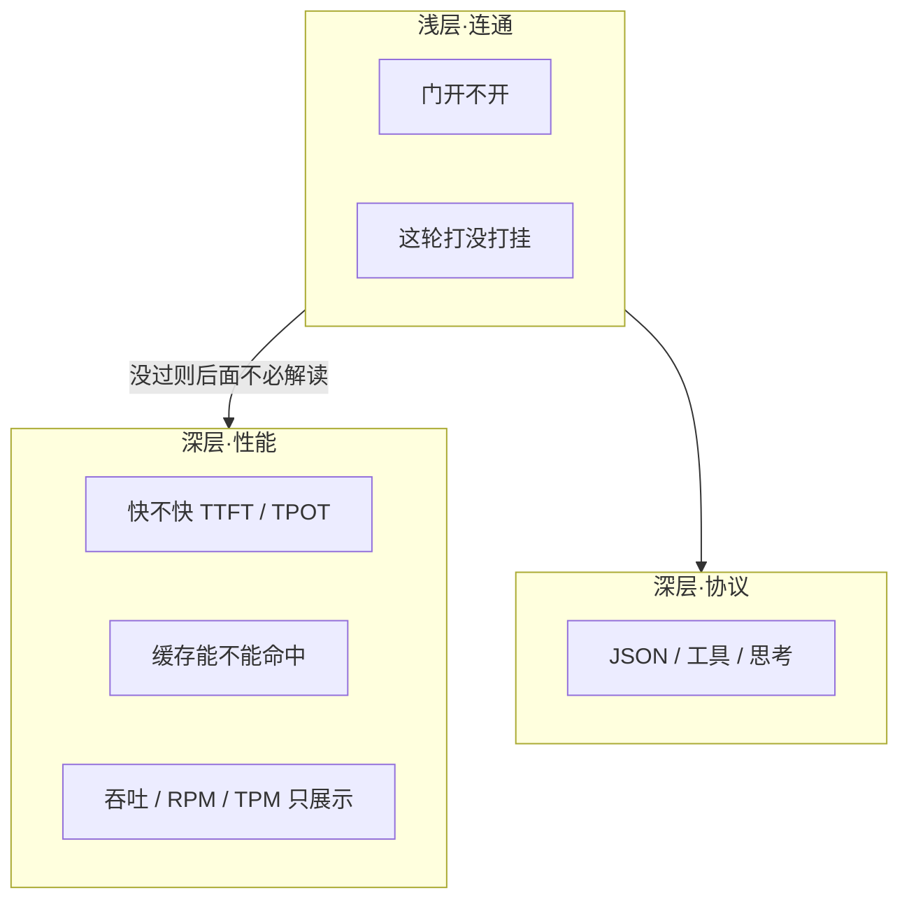
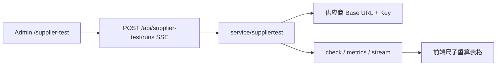

# 供应商自测工作台

对照《供应商自测指标说明（精简）》。测的是上游 API 能不能当生产入口，不是模型聪不聪明，也不是本平台的渠道、计费或转发。

## 三层在测什么

| 层 | 没过意味着 | 判定 |
|---|---|---|
| 浅层·连通 | 后面性能、协议都不必解读 | 检查项：通过 / 跳过 / 失败。压测错误率：正常 / 异常 |
| 深层·性能 | 能连，体验或成本可能不行 | 正常 / 偏慢 / 无法对照 |
| 深层·协议 | 多数厂商本来就没做 | 不接受或没有对应结构 → 跳过，不是供应商坏了 |

判定标准：延迟指标用 **正常 / 偏慢 / 无法对照**；连通性、错误率与命中率指标用 **正常 / 异常**。浅层连通未通过（如错误率异常）时，深层性能标记为“无法对照”，避免幸存者偏差。尺子可编辑，改完表格马上重算，不必重跑。

## 怎么跑（操作顺序，不是三个独立产品）

页面上仍是三个按钮，对应一次真实验收顺序：

1. **基础全量**（浅层检查 + 协议抽查）
2. **缓存**（约 3k 或更长语料原文，不垫字）
3. **压测**（冷路径勾选打断缓存；命中后体感不要勾）
4. 按该厂商改尺子

直连上游。不经过渠道表、不扣费、不写 relay 日志。

## 代码落点

| 层 | 路径 |
|---|---|
| 页面 | `web/src/features/supplier-test/` |
| 尺子与三档判定 | `baselines.ts`（默认宽松 / 较严，可改） |
| 语料 | `corpora/`，名称后的 token 数为估算 |
| SSE 入口 | `controller/supplier_probe.go` → `POST /api/supplier-test/runs` |
| 真正发请求 | `service/suppliertest/runner.go` |
| 厂商请求/解析适配 | `vendor.go`、`client.go`，说明见 [SUPPLIER_TEST_VENDORS.zh_CN.md](./SUPPLIER_TEST_VENDORS.zh_CN.md) |
| 导出报告 | `report.ts`，按三层排 |

## 和指标说明对齐的约定

- 空温度、`top_p` 不发送。
- 缺字段、厂商没做的协议：默认 **跳过**。下拉选了 GLM / Kimi / DeepSeek 后，文档要求有的字段没有则失败。请求键名与响应别名见 [SUPPLIER_TEST_VENDORS.zh_CN.md](./SUPPLIER_TEST_VENDORS.zh_CN.md)。
- 连通失败后，流式 / usage / request id / 采样改为跳过（无法对照），不再记成失败。
- 基础验收里，只有勾了流式的连通性才展示模型正文。
- 缓存预热发送选中语料原文，不填充到 N token。
- 压测可走缓存 = 每枪同一语料；打断缓存 = 语料前加随机前缀。
- 缓存命中率、TTL 是否达标只看页面尺子，后端检查项只负责有没有拿到 `cached_tokens`。
- RPM / TPM 是这轮短测推算，不是厂商上限。
- Max tokens 只限制输出长度。

## 不是什么

不是学科评测、不是配额打满、不是 tokenizer 审计、不是渠道健康检查、不是计费验收。
